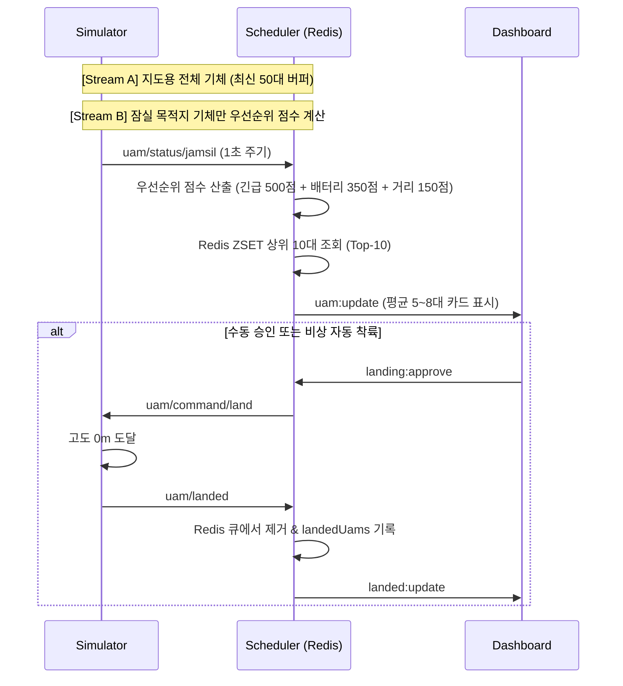
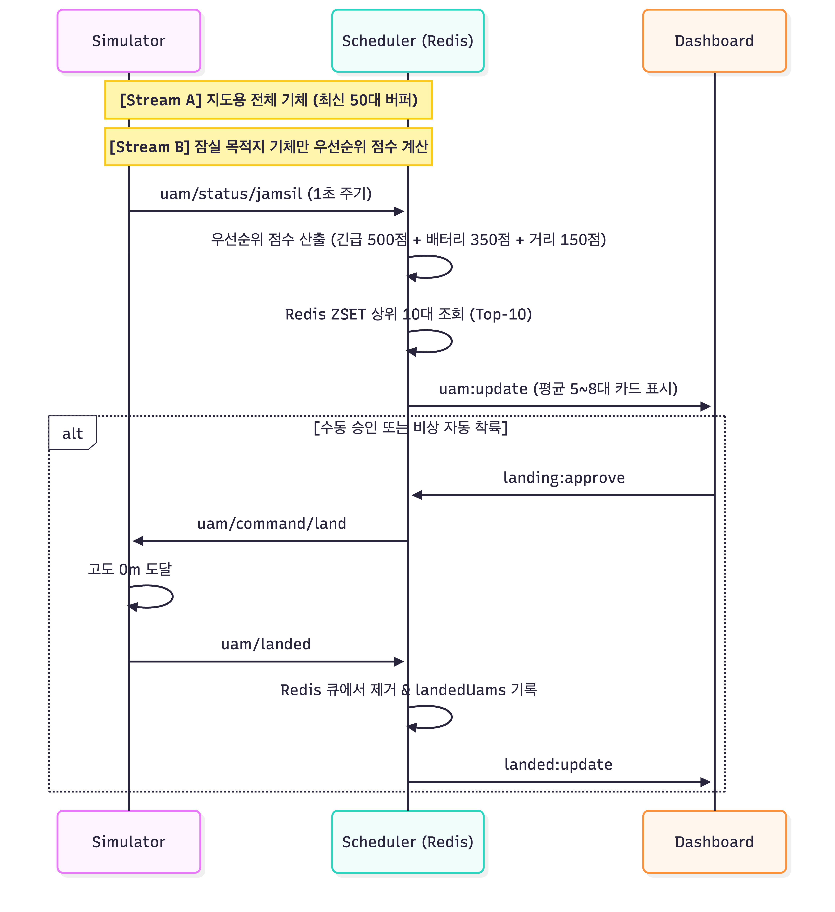

# UAM 기체 생성 및 비행 라이프사이클 로직

UAM 시뮬레이터, 스케줄러, 대시보드 간의 기체 생성부터 비행, 착륙, 재생성에 이르는 핵심 라이프사이클 요약 문서입니다.

---

## 1. 기체 생성 및 플릿(Fleet) 운용

* **동시 운용 규모 (Fleet Size)**: **상시 20대 유지** (`INITIAL_FLEET_SIZE = 20`)
* **초기 생성**: 시뮬레이터 구동 즉시 20대의 UAM 인스턴스 시작
* **스폰 초기값**:
  * **기체 식별자(ID)**: `UAM-{timestamp 4자리}-{random 3자리}` (예: `UAM-8192-304`, 중복 원천 방지)
  * **노선**: 3대 버티포트(여의도, 잠실, 수서) 중 출발지/목적지 무작위 매칭
  * **위치**: 전체 비행 구간의 **20% ~ 80%** 지점 (비행 중 상태 시뮬레이션)
  * **고도**: 순항 고도 **500m**
  * **속도**: 약 **118 km/h ~ 396 km/h**
  * **배터리**: **25% ~ 90%** 무작위 부여
* **순환 재생성**: 기체 1대가 착륙 완료 시 **2초 후 신규 기체 1대 생성**하여 20대 규모 지속 유지
* **3분 자동 환경 리셋 (Demo Refresh)**: 스케줄러가 매 3분(180초)마다 시뮬레이터 및 Redis/메모리 데이터를 초기화하여 항상 신선한 비행 및 큐 상태를 유지

---

## 2. 비행 단계별 고도 및 상태 전이 (1초 틱 갱신)

각 기체는 **1초 간격**으로 위치, 고도, 배터리를 계산하고 MQTT로 텔레메트리를 전송합니다.

| 비행 단계 | 진입 조건 | 고도 제어 | 동작 상태 |
| :--- | :--- | :--- | :--- |
| **① 순항 (Cruise)** | 목적지 거리 > 4.0km | **500m 유지** (초당 +10m 보정) | 목적지를 향해 정상 속도 비행 |
| **② 접근 (Approach)** | 목적지 거리 ≤ 4.0km | **175m로 점진 하강** (초당 -15m) | 버티포트 진입 감속 및 고도 강하 |
| **③ 대기 (LDP 호버링)** | 목적지 거리 ≤ 0.2km | **75m 유지** (초당 -25m 후 유지) | 수평 이동 중단(`waitingForLanding: true`), 착륙 승인 대기 |
| **④ 착륙 (Landing)** | 승인 완료 또는 배터리 비상 | **0m까지 강하** (초당 -20m) | 최종 착륙 터치다운 수행 |

---

## 3. 배터리 소모 및 긴급 착륙 안전 메커니즘

* **초당 배터리 소모율**:
  $$\text{Drain Rate} = 0.05 + (\text{Speed} \times 150) \quad (\approx \text{초당 } 0.095\% \sim 0.155\%)$$
* **긴급 강제 착륙 (Emergency Auto-Landing)**:
  * 잠실 상공에서 착륙 승인을 받지 못하고 호버링 중 **배터리가 15% 미만**으로 하락 시 발동
  * 관제 승인 여부와 무관하게 `landingApproved = true` 강제 전환 및 즉시 하강 개시

---

## 4. 스케줄러 & 대시보드 큐 연동

* **우선순위 점수 (1,000점 만점)**:
  1. 비상 상황 ($S_E$): 배터리 15% 미만 시 **500점**
  2. 배터리 잔량 ($F_B$): 10% 이하 시 **350점** 만점, 10~20% 사이 선형 가산
  3. 거리/시간 ($F_D$): 버티포트에 가까울수록 최대 **150점**
* **대시보드 표시**:
  * **Top-10 상한 제한**: 전체 잠실 목적 기체(평균 5~8대) 중 상위 최대 10대만 카드 표시
  * **착륙 완료 시**: 카드 목록에서 즉시 제거되고 착륙 완료 목록(`landedUams`)으로 이동
