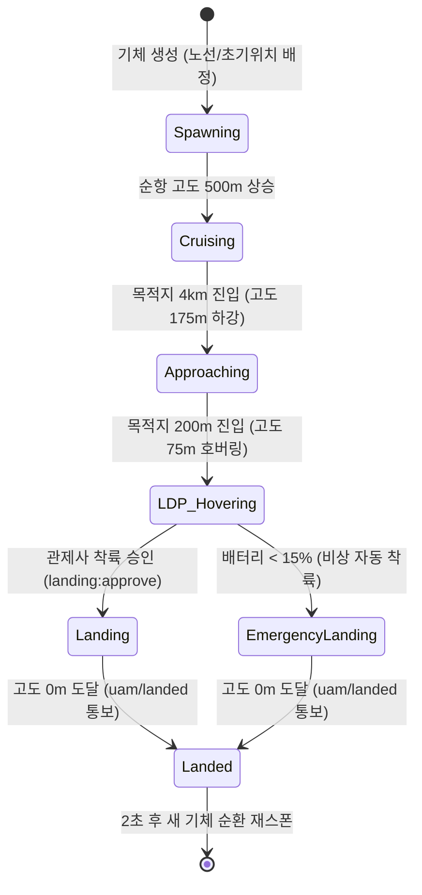

# UAM Flight Simulator (`@uam/simulator`)

도심항공교통(UAM) 환경에서 가상 기체들의 비행 궤적, 물리 속성(고도, 속도, 배터리 소모), 착륙 절차(LDP 접근 및 관제 승인)를 실시간으로 모사하고 **MQTT(Mosquitto)** 브로커로 고빈도 텔레메트리를 발송하는 시뮬레이션 엔진입니다.

---

## 1. 주요 사양 및 운용 파라미터

| 항목 | 설정값 | 설명 |
| :--- | :--- | :--- |
| **기본 함대 크기 (Fleet Size)** | 20대 (`INITIAL_FLEET_SIZE`) | 시스템 기동 시 20대의 UAM 기체가 동시 비행 |
| **초기 스폰 위치** | **출발지-목적지 간 20% ~ 80%** | 비행 중인 상태를 모사하기 위해 노선 중간 무작위 위치에서 생성 |
| **텔레메트리 주기** | **1,000ms (1 Hz)** | 1초마다 기체 위치/상태 계산 후 MQTT 브로드캐스트 |
| **비행 속도 범위** | **약 120 ~ 396 km/h** | `0.0003 ~ 0.0010 deg/s` (평균 약 225 km/h) |
| **순항 고도 (Cruise Alt)** | **500 m** | 기본 도심 회랑 순항 고도 |
| **접근 고도 (Approach Alt)** | **175 m** | 목적지 4.0 km 이내 진입 시 점진적 하강 |
| **LDP 고도 (Landing Decision Point)** | **75 m** | 목적지 0.2 km(200m) 진입 시 착륙 대기 호버링 고도 |
| **비상 배터리 마지노선** | **15%** | 15% 미만 도달 시 관제 승인 없이 비상 강제 자동 착륙 모드 진입 |

---

## 2. 버티포트(Vertiport) 및 운항 노선

서울 도심 핵심 3대 거점을 기준으로 출발지와 목적지가 무작위로 교차 배정됩니다.

```
[여의도] ────── 약 16.27 km ────── [잠실]
   \                                /
    \                              /
 약 18.00 km                   약 3.08 km
      \                          /
       ───────  [수서]  ────────
```

* **여의도 Vertiport**: `(37.525, 126.924)`
* **잠실 Vertiport**: `(37.513, 127.108)` (스케줄러 착륙 큐 집중 관제 대상)
* **수서 Vertiport**: `(37.488, 127.123)`

---

## 3. 텔레메트리 패킷 규격 (`UamVehicleStatus`)

매초 `uam/status/{destinationKey}` 토픽으로 발행되는 데이터 구조입니다:

```json
{
  "packetId": "UAM-0001#pkt12_1728001234567",
  "uamId": "UAM-0001",
  "latitude": 37.5182,
  "longitude": 127.0543,
  "altitude": 175,
  "batteryPercent": 68.4,
  "timestamp": 1728001234567,
  "heading": 112.5,
  "destinationKey": "jamsil",
  "distanceToTargetKm": 3.45,
  "speedKmh": 218,
  "etaSeconds": 57,
  "waitingForLanding": false
}
```

### 필드 상세 설명
* `packetId`: `[uamId]#pkt[seq]_[timestamp]` 포맷의 단조 증가 고유 식별자 (E2E 레이턴시 및 유실률 추적용).
* `altitude`: 4단계 비행 단계(순항 500m $\rightarrow$ 접근 175m $\rightarrow$ LDP 호버링 75m $\rightarrow$ 최종 착륙 0m)를 반영.
* `batteryPercent`: 비행 속도 및 거리에 비례하여 점진적으로 소모 (`0.05 + speed * 150`).
* `distanceToTargetKm`: Haversine 공식을 통한 목적지 버티포트까지의 직선 잔여 거리.
* `waitingForLanding`: 목적지 반경 200m(LDP) 내 진입하여 최종 관제 착륙 승인을 대기하는 호버링 상태 플래그.

---

## 4. 기체 라이프사이클 (State Machine)



1. **생성(Spawning)**: 비행 중 상태를 모사하기 위해 출발지-목적지 간 20%~80% 지점에서 무작위 배터리(25~90%)로 스폰.
2. **접근 및 호버링(LDP)**: 목적지 반경 200m 도달 시 속도를 0으로 줄이고 75m 고도에서 호버링 대기.
3. **착륙 승인 및 하강**: 관제 대시보드(또는 비상 로직)에서 승인이 떨어지면 초당 20m씩 수직 하강.
4. **착륙 완료(`uam/landed`)**: 고도 0m 도달 시 스케줄러에 완료 이벤트를 알리고 2초 후 새로운 기체로 자동 순환 재시작.

## 5. 비행 시간 및 텔레메트리 발생량 산출 (참고사항)

기체 1대가 스폰되어 착륙할 때까지의 생애 주기(Life-cycle) 동안 발생하는 비행 시간 및 데이터 발생량 분석입니다:

* **실제 잔여 비행 거리**: 약 0.6 km ~ 14.4 km (스폰 비율 20~80% 반영, 가중 평균 **약 6.2 km**)
* **평균 비행 속도**: 약 120 ~ 396 km/h (평균 **약 225 km/h**)
* **단계별 소요 시간**:
  1. **순항 이동 시간**: $\frac{6.0\text{ km}}{225\text{ km/h}} \times 3600 \approx \mathbf{96\text{초}}$
  2. **LDP 호버링 대기 시간**: 약 **5초**
  3. **최종 수직 하강 시간 ($75\text{m} \rightarrow 0\text{m}$)**: $\frac{75\text{m}}{20\text{m/s}} \approx \mathbf{4\text{초}}$
* **기체 1대당 최종 평균 비행 시간**: $96 + 5 + 4 = \mathbf{105\text{초} \approx 100\text{초} \sim 110\text{초}}$
* **총 텔레메트리 패킷 발생량**: 1Hz(1초당 1회) 발송 기준 기체 1대당 **약 100개 패킷** 발생 $\rightarrow$ *이 중 92개는 Redis/인메모리에서 소화하고 8개 핵심 이벤트만 DB에 영속화하여 **92% Disk I/O 격리** 달성.*

---

## 6. 제어 명령어 수신 인터페이스 (MQTT Subscribe)

시뮬레이터는 스케줄러로부터 아래 명령 토픽을 수신하여 기체 동작을 제어합니다:

* `uam/command/land`: 특정 `uamId`에 대해 착륙 승인(`approveLanding`) 명령 하달 $\rightarrow$ LDP 호버링 중인 기체가 지상으로 하강 개시.
* `uam/command/reset`: 전체 시뮬레이션 상태 초기화 및 20대 기체 재스폰.
