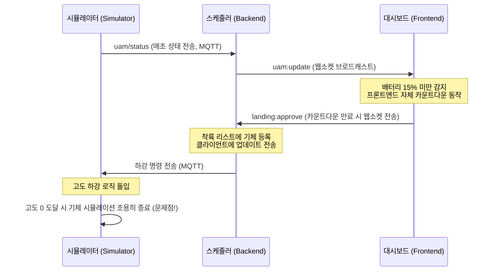
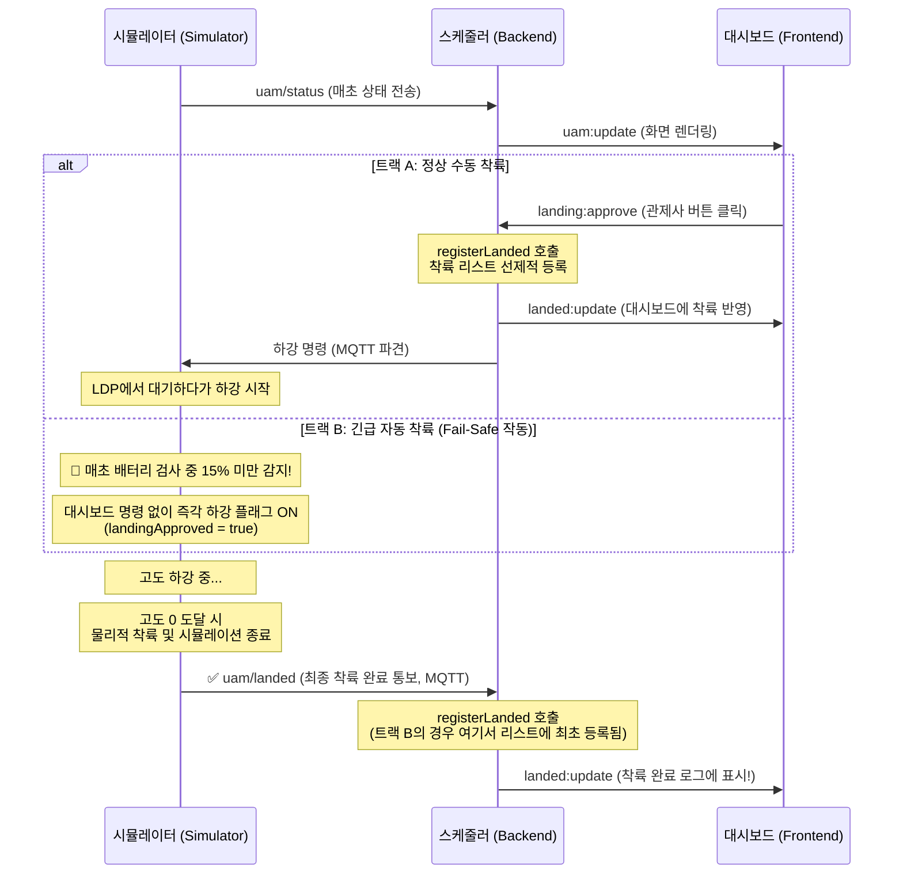

# UAM Density Control - 착륙 아키텍처 리팩토링 문서

본 문서는 UAM 관제 시스템의 긴급 자동 착륙(Emergency Auto-Landing) 및 정상 수동 착륙 과정을 개선한 아키텍처 리팩토링의 전후 차이점을 정리한 문서입니다.

## 1. 리팩토링 배경 (기존 문제점)
초기 프로토타입에서는 대시보드(Frontend)가 주도권을 쥐고 긴급 상황을 감지하여 타이머를 돌리고 강제로 착륙 승인(Approve) 이벤트를 전송하는 구조였습니다.
이로 인해 다음과 같은 치명적인 문제점이 발생했습니다.
- **안전성 결여 (Fail-Safe 부재):** 관제사 브라우저가 꺼지거나 네트워크가 단절되면 긴급 착륙 트리거가 작동하지 않아 기체가 공중에 방치됨.
- **착륙 완료 처리 누락 (Ghost 버그):** 시뮬레이터가 스스로 배터리 고갈로 하강하여 시뮬레이션을 종료해도, 스케줄러(백엔드)에 통보하지 않아 기체가 지도에서 조용히 사라질 뿐 착륙 완료 로그에 남지 않음.

---

## 2. 변경 전 (Before) 아키텍처 플로우

대시보드 의존적인 흐름(Frontend-driven) 구조를 나타냅니다.

---

## 3. 변경 후 (After) 아키텍처 플로우

관심사 분리(Separation of Concerns)를 통해 **대시보드는 수동 제어와 철저한 모니터링(Viewer)** 역할만 담당하고, **생존 기믹(Fail-safe)은 시뮬레이터가 자율적으로 판단**하며, **착륙 데이터의 정합성은 스케줄러가 중앙 통제**(Event-Driven)하도록 개편되었습니다.

## 4. 리팩토링 주요 효과 (Benefit)

1. **단일 진실 공급원 (Single Source of Truth) 기반 안전 보장**:
   프론트엔드 연결 유무와 상관없이 기체(시뮬레이터) 내부 배터리가 15%가 되는 순간 **무조건 강제 하강**을 시작하여 항공 규정상 안전 마지노선을 지킵니다. 대시보드의 임계값은 20%로 상향하여 관리자가 상황을 미리 인지하고 **선제적 수동 대응**을 할 수 있도록 유도합니다.
2. **이벤트 기반 완료 선언 (Event-Driven Completion)**:
   어떤 방식으로 기체가 내려왔든 간에(수동 vs 자동 강제), 시뮬레이터가 땅에 착지하는 시점에 `uam/landed` 이벤트를 스케줄러로 발송함으로써 착륙 완료 큐 정리가 100% 보장됩니다.
3. **프론트엔드 복잡도 및 버그 최소화**:
   리액트(App.tsx) 내부의 수많은 렌더 루프 및 `setTimeout` 타임아웃, 예외 처리(ClearTimeout), 동시성 문제(중복 승인) 요소가 완벽하게 사라졌습니다.
